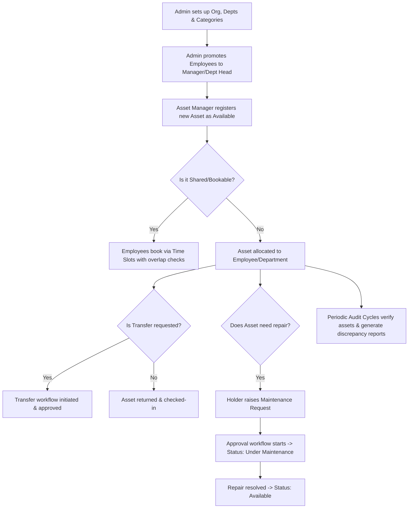

# AssetFlow
## Enterprise Asset & Resource Management System

---

## 📋 Overview

### 👁️ Overall Vision
The vision for **AssetFlow** is to simplify and digitize how organizations track, allocate, and maintain their physical assets and shared resources through a centralized ERP platform. 

AssetFlow is industry-agnostic: any organization with equipment, furniture, vehicles, or shared spaces (offices, schools, hospitals, factories, agencies) can leverage it to streamline operations.

The platform aims to reduce manual tracking inefficiencies (e.g., spreadsheets, paper logs) by enabling structured asset lifecycles, centralized resource booking, and real-time visibility into who holds what, where it is, and its current condition.

AssetFlow focuses on delivering core ERP functionality with clean architecture, role-based workflows, and a scalable module design—without touching purchasing, invoicing, or accounting concerns.

---

### 🎯 Mission
The mission for the hackathon team is to build a user-centric, responsive application that simplifies asset and resource management for any organization. The platform should provide staff with intuitive tools to:
* **Set up** departments, asset categories, and the employee directory.
* **Register & track** assets through their full lifecycle.
* **Allocate** assets to employees or departments with conflict handling.
* **Book** shared resources (rooms, vehicles, equipment) without overlaps.
* **Run** a structured maintenance approval workflow.
* **Execute** structured audit cycles to catch discrepancies.
* **Get notified** of overdue returns, bookings, and maintenance events.

---

### ❓ Problem Statement
The application must demonstrate proper ERP architecture, reusable modules, secure role-based workflows (with realistic account creation, not self-assigned admin roles), and an intuitive UI/UX while handling complex relationships between departments, employees, assets, bookings, maintenance requests, and audits.

---

## 🛠️ Core Features

* **Master Data Management:** Maintain departments, asset categories, and a centralized employee directory.
* **Flexible Asset Lifecycle Tracking:** Track assets across various states: `Available`, `Allocated`, `Reserved`, `Under Maintenance`, `Lost`, `Retired`, and `Disposed`, with valid transition flows (e.g., `Available` ↔ `Under Maintenance`, `Allocated` → `Available`).
* **Conflict-Free Allocation:** Allocate assets to employees/departments, with strict systems preventing double-allocation of a single asset.
* **Overlap-Free Booking:** Book shared/limited resources by time slot with real-time overlap validation.
* **Structured Maintenance Workflows:** Route maintenance requests through an approval workflow before repair work starts.
* **Structured Audits:** Run scheduled audit cycles with assigned auditors and auto-generated discrepancy reports.
* **Operational Visibility:** Surface overdue returns, bookings, and maintenance activity through active notifications and an interactive KPI dashboard.

---

## 👥 User Roles

| Role | Responsibilities |
| :--- | :--- |
| **Admin** | • Manages departments, asset categories, audit cycles, and employee/role assignments (Organization Setup). • Views organization-wide analytics. |
| **Asset Manager** | • Registers and allocates assets. • Approves transfers, maintenance requests, and audit discrepancy resolutions. • Approves asset returns and condition check-in notes. |
| **Department Head** | • Views assets allocated to their department. • Approves allocation/transfer requests within their department. • Books shared resources on behalf of the department. |
| **Employee** | • Views assets allocated to them. • Books shared resources. • Raises maintenance requests. • Initiates return/transfer requests. |

---

## 🔄 Basic Workflow

1. **Setup:** Admin sets up departments, asset categories, and promotes select employees to Department Head or Asset Manager.
2. **Registration:** Asset Manager registers a new asset, which enters the system as `Available`.
3. **Allocation / Share:** Asset is allocated to an employee/department (blocked if already allocated; a transfer request is required instead) or marked as a shared bookable resource.
4. **Booking:** Employees book shared resources by time slot; overlapping requests are rejected automatically.
5. **Maintenance:** If an asset needs repair, the holder raises a maintenance request, which must be approved before work begins and before the asset flips to `Under Maintenance`.
6. **Transfer / Return:** Assets are transferred or returned as needs change; overdue returns are flagged automatically.
7. **Audit:** Periodic audit cycles assign auditors, verify assets, and auto-generate discrepancy reports before closing.
8. **Logging:** All activity is tracked through notifications, logs, and reports.

---

## 🖥️ Screen Layouts & Key Functionality

### 1. Login / Signup Screen
* **Purpose:** Authenticate users with realistic, non-self-elevating account creation.
* **Key Functionality:**
  * Signup creates an **Employee** account only (no role selection at signup).
  * Admins promote Employees to Department Heads or Asset Managers from the Employee Directory (see Screen 3).
  * Email & password login, forgot password, and session validation.

### 2. Dashboard / Home Screen
* **Purpose:** Give every role a real-time operational snapshot.
* **Key Functionality:**
  * **KPI Cards:** Assets Available, Assets Allocated, Maintenance Today, Active Bookings, Pending Transfers, Upcoming Returns.
  * **Overdue Returns:** Highlighted separately from upcoming returns (past Expected Return Date).
  * **Quick Actions:** Register Asset, Book Resource, Raise Maintenance Request.

### 3. Organization Setup Screen (Admin Only - 3 Tabs)
* **Purpose:** Maintain the master data everything else depends on.
* **Key Functionality:**
  * **Tab A - Department Management:** Create/edit/deactivate departments. Assign Department Head, optional Parent Department (for hierarchy), and Status (Active/Inactive).
  * **Tab B - Asset Category Management:** Create/edit categories (Electronics, Furniture, Vehicles, etc.). Optional category-specific fields (e.g., warranty period for Electronics).
  * **Tab C - Employee Directory:** Manage Name, Email, Department, Role, and Status (Active/Inactive). Admin promotes an Employee to Department Head or Asset Manager here (this is the only place roles are assigned).

### 4. Asset Registration & Directory Screen
* **Purpose:** Register assets and search/track them centrally.
* **Key Functionality:**
  * **Register:** Name, Category (from Screen 3), auto-generated Asset Tag (e.g., `AF-0001`), Serial Number, Acquisition Date, Acquisition Cost (kept for ranking/reports only, not linked to accounting), Condition, Location, photo/documents, and "shared/bookable" flag.
  * **Search & Filter:** Search by Asset Tag, Serial Number, QR code, category, status, department, or location.
  * **Lifecycle Status:** Clear state display (`Available`, `Allocated`, `Reserved`, `Under Maintenance`, `Lost`, `Retired`, `Disposed`).
  * **History:** Per-asset logs for allocation and maintenance history.

### 5. Asset Allocation & Transfer Screen
* **Purpose:** Manage who holds what, with explicit conflict rules.
* **Key Functionality:**
  * **Allocate:** Assign asset to employee/department with an optional Expected Return Date.
  * **Conflict Rule:** Double-allocation is blocked. Example: *Priya has Laptop AF-0114. If Raj tries to allocate it, the system blocks the action, displays "Currently held by Priya", and offers a "Transfer Request" option instead.*
  * **Transfer Workflow:** `Requested` → `Approved` (by Asset Manager or Department Head) → `Re-allocated` (history updated automatically).
  * **Return Flow:** Mark as returned, capture condition check-in notes, and revert asset status to `Available`.
  * **Overdue Flags:** Allocations past Expected Return Date are auto-flagged and feed the Dashboard + Notifications.

### 6. Resource Booking Screen
* **Purpose:** Time-slot booking of shared resources with zero overlaps.
* **Key Functionality:**
  * **Calendar View:** Visual overview of a resource's existing bookings.
  * **Overlap Validation:** Overlapping bookings are blocked. Example: *Room B2 is booked 9:00–10:00. A request for 9:30–10:30 is rejected; a request for 10:00–11:00 is approved.*
  * **Booking Status:** `Upcoming`, `Ongoing`, `Completed`, `Cancelled`.
  * **Management:** Cancel/reschedule support; reminder notifications before the slot starts.

### 7. Maintenance Management Screen
* **Purpose:** Route repairs through approval before work starts.
* **Key Functionality:**
  * **Raise Request:** Select asset, describe issue, set priority, and attach photo.
  * **Workflow:** `Pending` → `Approved / Rejected` (by Asset Manager) → `Technician Assigned` → `In Progress` → `Resolved`.
  * **Lifecycle Sync:** Asset status auto-updates to `Under Maintenance` on approval, and reverts to `Available` on resolution.
  * **History:** Maintenance history is retained per asset.

### 8. Asset Audit Screen
* **Purpose:** Run structured verification cycles instead of a single form.
* **Key Functionality:**
  * **Create Audit Cycle:** Define scope (department/location) and date range.
  * **Assign Auditors:** Assign one or more auditors to the cycle.
  * **Auditing:** Auditor marks each asset as `Verified`, `Missing`, or `Damaged`.
  * **Discrepancy Reporting:** System auto-generates a discrepancy report for flagged items.
  * **Close Cycle:** Closing locks the cycle and updates affected asset statuses (e.g., status changed to `Lost` for confirmed-missing items).
  * **Audit History:** Saved per cycle.

### 9. Reports & Analytics Screen
* **Purpose:** Give managers actionable operational insights.
* **Key Functionality:**
  * Asset utilization trends (most-used vs. idle assets).
  * Maintenance frequency by asset/category.
  * Assets due for maintenance or nearing retirement.
  * Department-wise allocation summary.
  * Resource booking heatmap (peak usage windows).
  * Exportable reports.

### 10. Activity Logs & Notifications Screen
* **Purpose:** Keep every role informed without digging for updates.
* **Key Functionality:**
  * **Notification Alerts:** Asset Assigned, Maintenance Approved/Rejected, Booking Confirmed/Cancelled/Reminder, Transfer Approved, Overdue Return Alert, and Audit Discrepancy Flagged.
  * **Audit Log:** Complete system-wide log of admin, manager, and employee actions (who did what and when).

---

## 🎨 Mockup & Design Resources
* **POC Wireframes / Mockups:** [Excalidraw Workspace](https://app.excalidraw.com/l/65VNwvy7c4X/5ceOBMjbDby)
